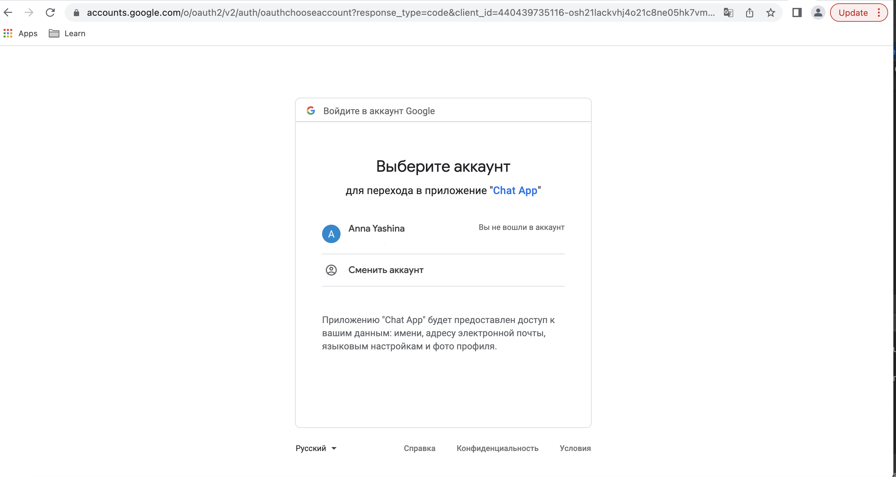
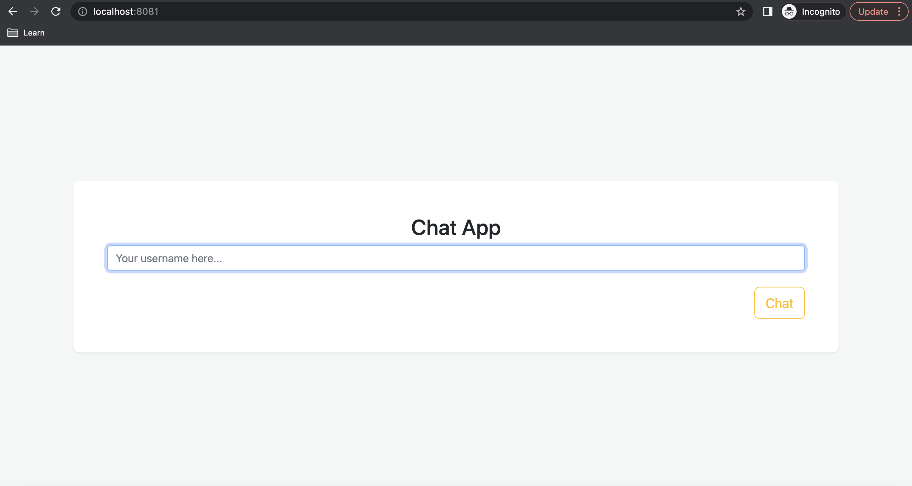
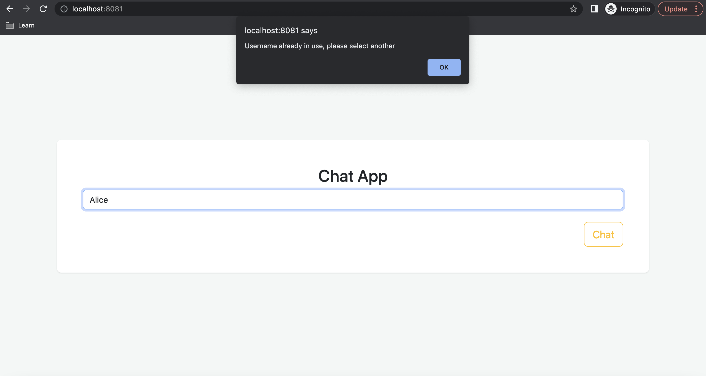
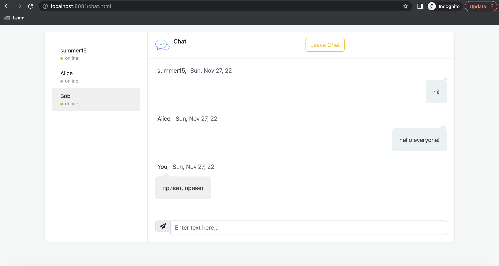
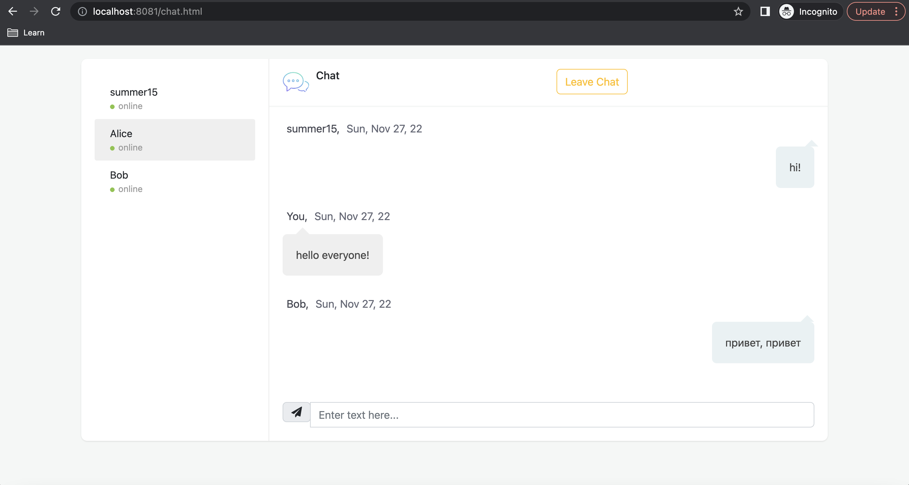
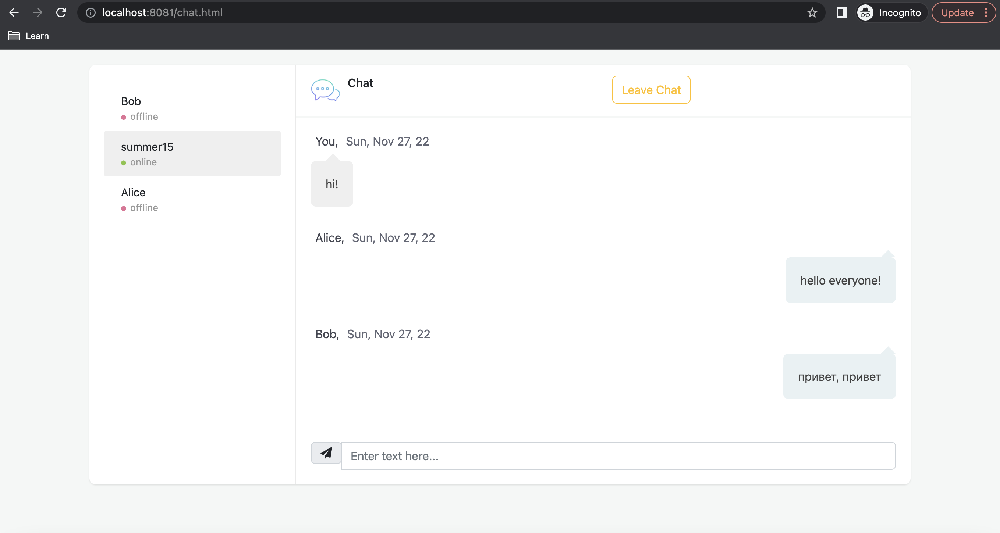

# Chat App

## 1. Запуск 
Для запуска приложения выполните команды:
```
cd chat-app
./gradlew clean build
docker-compose up
```

## 2. Описание приложения

Приложение доступно по адресу http://localhost:8081

1. Пользователь авторизуется через Google
 
2. Пользователь вводит свой ник
 
3. Ник уникален, каждый ник однозначно соответствует Google почте, с которой он был впервые использован. При несовпадении почты отображается ошибка, что ник уже занят.
 
4. На странице чата отображаются последние ```N``` сообщений (параметр ```app.input.size``` - значение по умолчанию = 5) и все активные пользователи. 
 
5. Текущий пользователь выделен среди остальных юзеров
 
 
6. Если пользователь закрывает окно браузера с чатом или нажимает на кнопку ```Leave Chat```, для остальных активных пользователей его статус меняется на ```offline```, пользователь перенаправляется на страницу с выбором ника.
 
